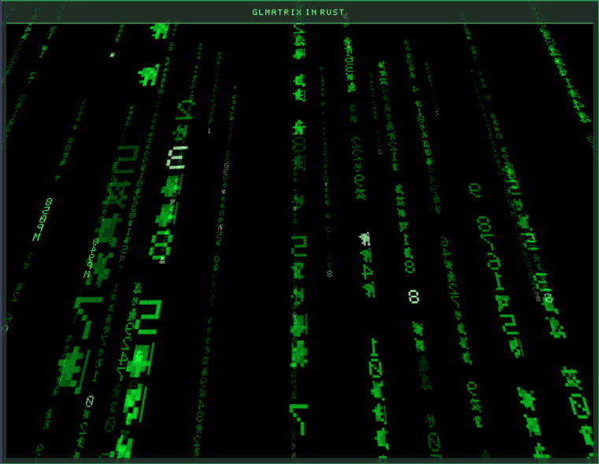

# glmatrix-rs



## Origin

This project is a Wayland-native Rust port of the XScreenSaver GLMatrix hack from:

- https://github.com/xscreensaver/xscreensaver/blob/master/hacks/glx/glmatrix.c

The linked GitHub repository contains the upstream `hacks/glx/glmatrix.c` implementation.

## License

`glmatrix-rs` is based on code by **Jamie Zawinski** from XScreenSaver. The upstream
`glmatrix` module states:

> Copyright © 1999-2003 by Jamie Zawinski.
>
> Permission to use, copy, modify, distribute, and sell this software and its
> documentation for any purpose is hereby granted without fee, provided that the
> above copyright notice appear in all copies and that both that copyright notice
> and this permission notice appear in supporting documentation.

No warranty is provided.

This repository keeps the same permission in spirit for the adapted code.

A dependency-free Rust port of `xscreensaver/hacks/glx/glmatrix.c`.

It keeps the original GLMatrix animation model: falling strips, spinner
glyphs, depth fog, brightness waves, additive blending, auto-rotating camera,
and the matrix/binary/decimal/hex/DNA glyph modes. Windowing and OpenGL are
provided through small manual Wayland/EGL/OpenGL FFI bindings instead of
crates. There is no X11 support.

## Install

Install from crates.io:

```sh
cargo install glmatrix-rs
```

Then run it:

```sh
glmatrix-rs
```

## Run From Source

```sh
cargo run --release
```

Useful options:

```text
-speed N          animation speed, default 1.0
-density N        coverage density, default 20
-mode NAME        matrix, binary, decimal, hexadecimal, dna
-binary           shortcut for -mode binary
-decimal          shortcut for -mode decimal
-hexadecimal      shortcut for -mode hexadecimal
-dna              shortcut for -mode dna
-clock / +clock   show/hide local time in some strips
-timefmt FMT      strftime format, default " %l%M%p "
-fog / +fog       enable/disable depth brightness fog
-waves / +waves   enable/disable brightness waves
-rotate / +rotate enable/disable camera auto-rotation
-texture / +texture enable/disable textured glyphs
-wireframe        draw glyph outlines
-width N          initial window width, default 1280
-height N         initial window height, default 720
```

Controls:

```text
Esc or q             quit
left mouse button    pause strip motion while held
click + drag         move the window
drag window edge     resize the window
double click         toggle fullscreen
```
