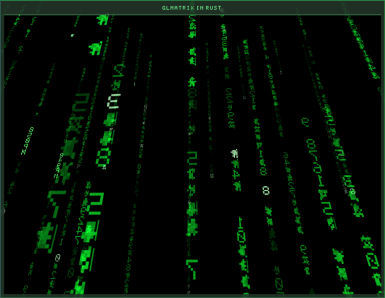

# glmatrix-rs



## Origin

This project is a Wayland-native Rust port of the XScreenSaver GLMatrix hack from:

- https://github.com/xscreensaver/xscreensaver/blob/master/hacks/glx/glmatrix.c

The linked GitHub repository contains the upstream `hacks/glx/glmatrix.c` implementation.

## License

`glmatrix-rs` is based on code by **Jamie Zawinski** from XScreenSaver. The upstream
`glmatrix` module states:

> Copyright © 1999-2003 by Jamie Zawinski.
>
> Permission to use, copy, modify, distribute, and sell this software and its
> documentation for any purpose is hereby granted without fee, provided that the
> above copyright notice appear in all copies and that both that copyright notice
> and this permission notice appear in supporting documentation.

No warranty is provided.

This repository keeps the same permission in spirit for the adapted code.

A dependency-free Rust port of `xscreensaver/hacks/glx/glmatrix.c`.

It keeps the original GLMatrix animation model: falling strips, spinner
glyphs, depth fog, brightness waves, additive blending, auto-rotating camera,
and the matrix/binary/decimal/hex/DNA glyph modes. Windowing and OpenGL are
provided through small manual Wayland/EGL/OpenGL FFI bindings instead of
crates. There is no X11 support.

Keyboard shortcuts follow the active keyboard layout through `libxkbcommon`.
The pointer uses a themed arrow, or a pointing hand over the visible close
button, through `libwayland-cursor`,
respecting `XCURSOR_THEME` and `XCURSOR_SIZE` when set.
In fullscreen, the cursor hides after 1.5 seconds of mouse inactivity and
reappears on movement, a click, or scrolling.
Building requires Rust and the development libraries for Wayland, EGL, OpenGL,
and xkbcommon. On Debian/Ubuntu, install `libwayland-dev libegl-dev libgl-dev
libxkbcommon-dev`. Runtime installations need the corresponding shared libraries.

## Install

Install from crates.io:

```sh
cargo install glmatrix-rs
```

Then run it:

```sh
glmatrix-rs
```

Desktop integration:

```sh
install -Dm644 glmatrix-rs.desktop "$HOME/.local/share/applications/glmatrix-rs.desktop"
```

Optional system-wide install:

```sh
sudo install -Dm644 glmatrix-rs.desktop /usr/share/applications/glmatrix-rs.desktop
```

## Run From Source

```sh
cargo run --release
```

Useful options:

```text
-speed N          animation speed, default 1.0
-density N        coverage density, default 20
-mode NAME        matrix, binary, decimal, hexadecimal, dna
-binary           shortcut for -mode binary
-decimal          shortcut for -mode decimal
-hexadecimal      shortcut for -mode hexadecimal
-dna              shortcut for -mode dna
-clock / +clock   show/hide local time in some strips
-timefmt FMT      strftime format, default " %l%M%p "
-fog / +fog       enable/disable depth brightness fog
-waves / +waves   enable/disable brightness waves
-rotate / +rotate enable/disable camera auto-rotation
-texture / +texture enable/disable textured glyphs
-flip / +flip     enable/disable glyph mirroring (default: disabled)
-wireframe        draw glyph outlines
--hdr=auto|on|off HDR output, default auto (SDR fallback)
-width N          initial window width, default 1280, maximum 16384
-height N         initial window height, default 720, maximum 16384
```

## HDR

HDR is selected automatically at startup when the compositor advertises HDR
headroom for the window and the driver supports the required rendering path.
Enable HDR in GNOME's Display Settings first. Startup reports whether HDR was
selected or why the application fell back to SDR.

```sh
glmatrix-rs --hdr=auto
glmatrix-rs --hdr=on
glmatrix-rs --hdr=off
```

`auto` is the default and falls back to the original SDR renderer. `on` requires
HDR support and reports an error if it cannot initialize it; it also permits HDR
when the compositor cannot describe the preferred output using protocol version
1. `off` skips HDR negotiation entirely.

The HDR path renders into an RGBA16F framebuffer, then converts the existing
sRGB colors to BT.2020/PQ in a 10-bit or FP16 RGB EGL window buffer. The renderer
tries fixed-point first, then explicitly requests floating-point formats on
drivers that expose `EGL_EXT_pixel_format_float`. Bright rain heads
and waves receive up to 600 cd/m2 highlights, limited by the initially advertised
display headroom when available. The titlebar and borders remain at normal
reference-white brightness, and the background remains opaque black. The
decorations use a separate transparent layer, so fading the titlebar does not
dim the rain behind it. The compositor handles output color conversion and tone mapping when the window is
moved between displays.

This requires the Wayland `wp_color_manager_v1` protocol with parametric PQ,
BT.2020 and luminance support, a 10-bit or FP16 EGL window configuration, and OpenGL
floating-point textures, framebuffer objects and GLSL. No additional libraries
or Rust crates are required. Enabling HDR in GNOME alone does not guarantee
that every driver exposes these application-side capabilities.

## Testing

Run the unit tests, including HDR mode parsing and EGL configuration fallback:

```sh
cargo test
```

Run all tests, including pixel-readback rendering tests, with Mesa's surfaceless
EGL platform (no desktop window is opened):

```sh
LIBGL_ALWAYS_SOFTWARE=true cargo test -- --include-ignored --test-threads=1
```

The rendering tests cover titlebar fading over HDR rain, opaque black borders,
PQ highlight and reference-white levels, transparent overlay compositing,
framebuffer resizing, and viewport preservation. Driver/compositor negotiation
and physical HDR display output still require a live Wayland session.

## Controls

```text
Esc or q             quit
F                    toggle fullscreen
Backspace or Delete  drop rain out of view, then restart
left mouse button    pause strip motion while held
click + drag         move the window
drag window edge     resize the window
double click         toggle fullscreen
```
